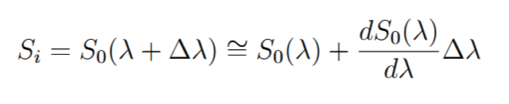
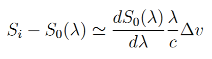
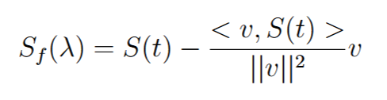

## Script files

- pca_sims.ipynb: 
    * PCA applied to a time series of simulated spectra (range from 6173.10077 &Aring; to 6173.599098 &Aring;, i.e. just one absorption line) with doppler correction to the wavelength.
- pca_sims2.ipynb:
    * PCA applied to simulated spectra. We take out the projection over the velocity vector. To do that, we first represent each spectrum as a slightly shifted the reference spectrum:
    
        

        Using the Doppler shift formula $\Delta v / c = \Delta \lambda / \lambda$, we get:

        

        Where $S_i$ is a simulated spectrum and $S_0$ is the reference spectrum (mask).
        We define $S(t) = S_i - S_0(\lambda)$ and $v = \frac{dS_0(\lambda)}{d\lambda} \frac{\lambda}{c}$. Then, the spectrum without the projection over the velocity vector is:

        

        Where $<v, S(t)>$ is the inner product. The PCA is applied to a matrix of $S_f$.
   
- pca_sims_raw.ipynb:
    * PCA applied to simulated spectra without doppler correction to the wavelength.